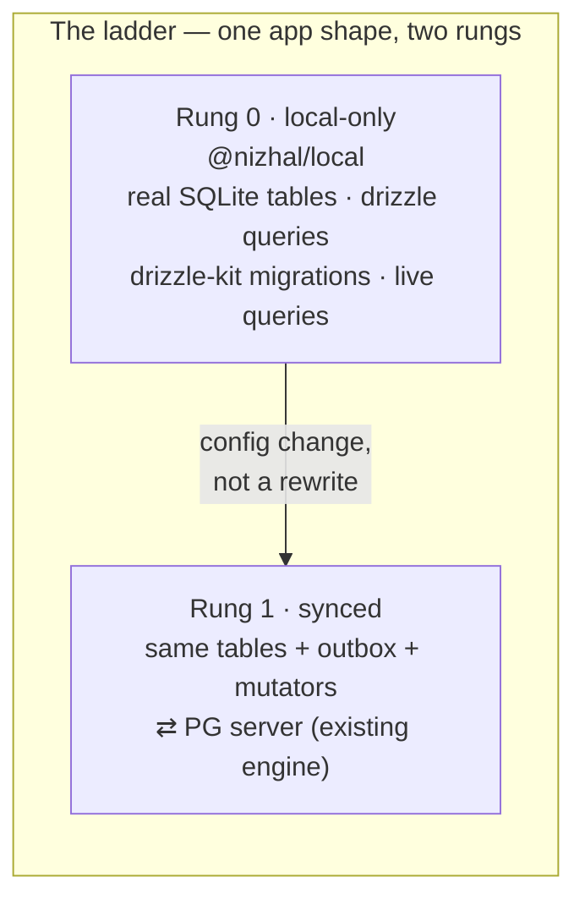
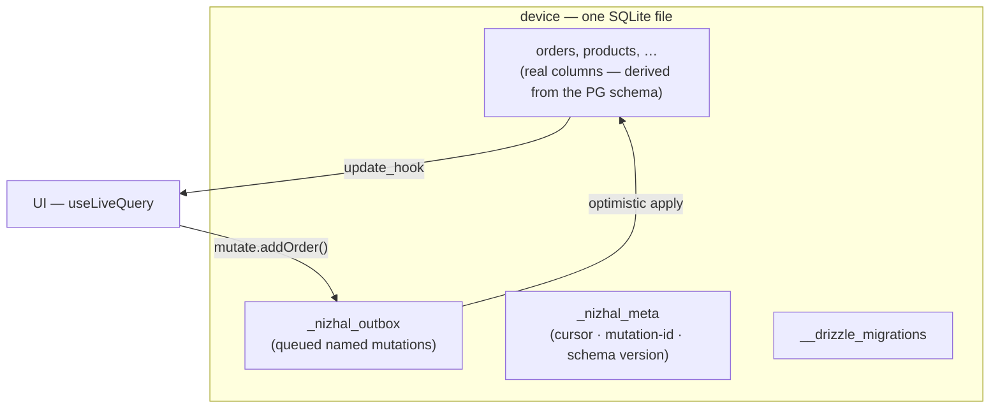
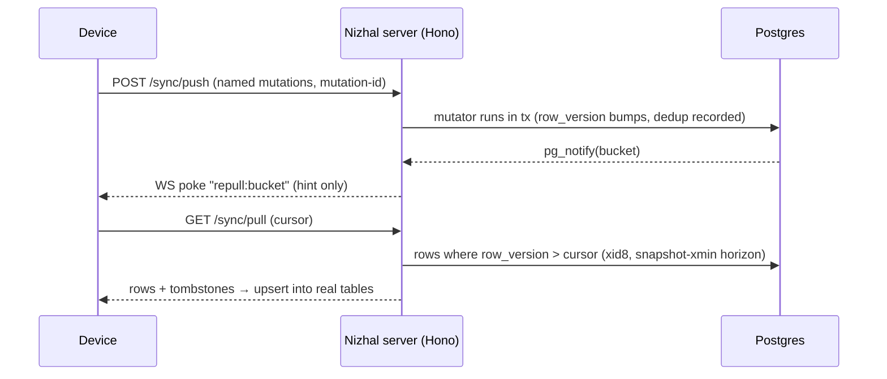
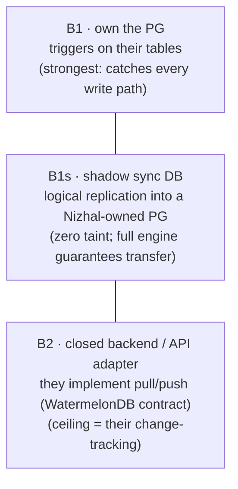
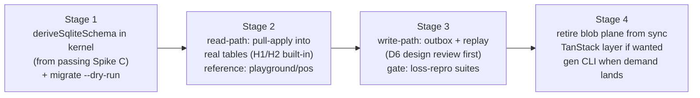

# Nizhal: Local↔Sync Convergence — Architecture

**Status:** agreed plan of record · 2026-07-02 · full detail: [`rfcs/rfc-local-sync-convergence.md`](../rfcs/rfc-local-sync-convergence.md)
**Stage honesty:** alpha, zero external users, one imminent release (tabkeep mobile). Everything
below is sized to that stage — no infrastructure for scale we don't have, no shortcuts that
endanger the release.

## The product in one picture

One schema (Drizzle `pgTable`, the kernel's existing dialect), one query surface (the real Drizzle
query builder), one reactivity model (`watch`/`useLiveQuery` off SQLite update hooks). Climbing a
rung adds sync configuration; it never changes how the app reads or writes.

## Chosen architecture

### 1. Client: one SQLite file, real tables, real transactions

**Why it matters:** the field's observed client-store failures (data wiped on reconnect, cursor
divorced from rows, schema-version wipes) are *composition failures between separate storage
mechanisms*. Putting rows, outbox, cursor, and schema bookkeeping in **one file under real SQLite
transactions** collapses the composition — cursor-and-rows can't diverge if they commit atomically.

### 2. Server: the existing PG engine, unchanged

Pull returns rows; push takes named mutations — the wire protocol never sees the client store, so
swapping the client plane risks nothing server-side. Impure server mutators are by design: state
through `tx` (atomic with the engine bookkeeping), external side effects through `ctx.jobs`
(transactional outbox — no commit, no job).

### 3. Brownfield: one dial — "how low can you capture changes?"

Framework-owned backends (Medusa, porulle) default to **B1s + read-model sync** — their migration
tooling fights direct column taint, their APIs run the real business invariants (writes always go
through the API), and the shadow holds the *denormalized shape the client renders*, not their
30-table normalized graph. **All tiers are documentation today; none is built until a real
integration exists.**

## What we are deliberately NOT building now (stage-fit cuts)

| Cut | Why |
|---|---|
| Full `nizhal gen` CLI (typed client, snapshot migrations, contract extension) | Zero consumers need codegen: greenfield shares `domain.ts` (type-perfect); brownfield-by-URL has no customer yet. **Demand-gated**: first brownfield integration or pre-1.0. Stage 1 ships only the kernel `deriveSqliteSchema` — runtime derivation, no codegen. |
| Client DDL migration tooling for synced tables | No shipped app has evolved a schema yet. Alpha story: regenerate + atomic nuke-and-repull (safe *by architecture*: outbox is separate and drains first). The one-file layout keeps real migrations open for later. |
| Migrating tabkeep onto the new plane | It's the imminent release — it ships on the proven blob-plane client (109 tests). `playground/pos` (already offline-only, already wants sync) is the new plane's reference app instead. |
| Brownfield tiers (shadow DB, adapters, Convex kit) | Recorded as protocol documentation; built when someone real asks. |
| Second server engine / storage adapters | The engine's guarantees are derived from PG internals (xid8, snapshot-xmin, LISTEN/NOTIFY). Other backends join at the wire protocol, not by porting the engine. |

## What we are NOT cutting (cheap now, catastrophic to retrofit)

- **H1 — no silent reads:** startup canary (write+read a sentinel through the full driver path);
  drivers throw on shape mismatch, never return `[]`.
- **H2 — sync only moves data forward:** pull-apply is upsert-only; any reset is an explicit
  operation committing truncate + repull + cursor in one SQLite transaction.
- **Gate discipline:** every stage passes the existing deterministic loss-repro suites,
  re-targeted at the new store.

## Rejected alternatives — and why

| Alternative | Verdict | Why |
|---|---|---|
| Build the local/sync client **on TanStack DB** | rejected | Their plane is JSON-blob KV + IVM collections — `db.select()` and drizzle-kit migrations are structurally impossible on it. Open correctness issues sit exactly where user data would live (tanstack/db #1499 silent SELECT loss, #1478 reconnect wipe, #1589 schema-version wipe, #1486 multi-tab leadership, #1567 corruption). Kept instead as an **optional layer**: a collection sourced *from* `local.watch()` — deferred until a consumer asks. |
| Bolt SQL onto the existing blob plane (views over JSON, PowerSync-style) | rejected | Forfeits real columns and drizzle-kit; PowerSync itself had to ship a drizzle-driver to meet drizzle demand. We'd build their compatibility layer instead of our product. |
| Neutral schema DSL (Zero/Payload-style) as the source of truth | rejected | Cleaner in theory, but forfeits "your existing drizzle `pgTable` just works" — Nizhal's wedge. PG-drizzle-as-source + mechanical lowering is spiked and passing (13/13). |
| PayloadCMS as the sync model | rejected (half-borrowed) | Payload is server-only — no offline, no client, no sync. We borrowed what it *does* prove: the pg↔sqlite lowering table and programmatic drizzle-kit migration generation. |
| Adapterize the PG storage engine now | rejected | Re-deriving the correctness argument per backend, bought for zero asking users. The wire protocol is the extension surface. |
| Two hand-maintained schemas (pg + sqlite per app) | rejected | Nobody in the field does this; every serious system is one source + mechanical lowering. Spike C proves ours. |

## The staged plan (each stage independently shippable)

Parallel, independent: tabkeep mobile release (existing plane, untouched) · protocol doc (one
page, unlocks B2 conversations) · porulle first-party integration (after Stage 2 exists).
