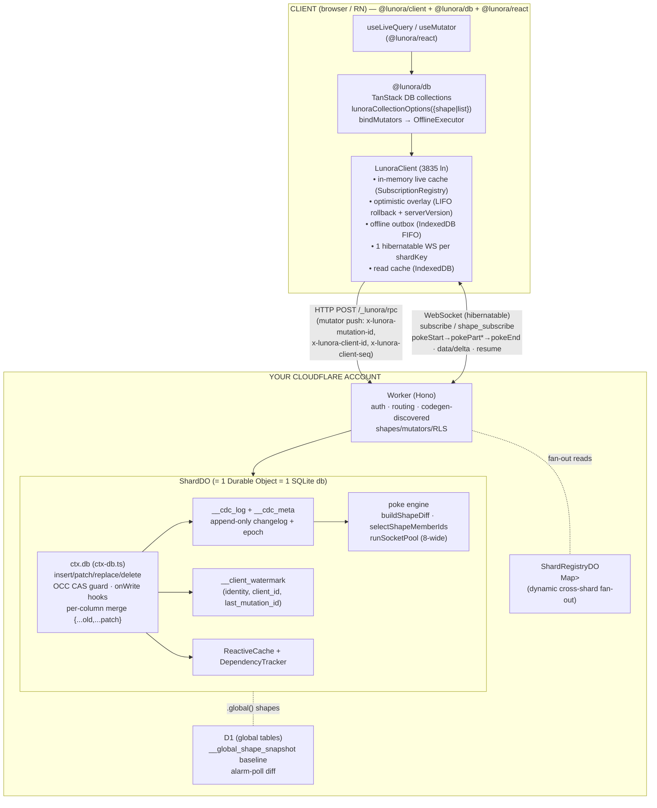
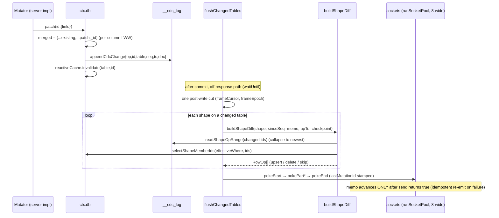
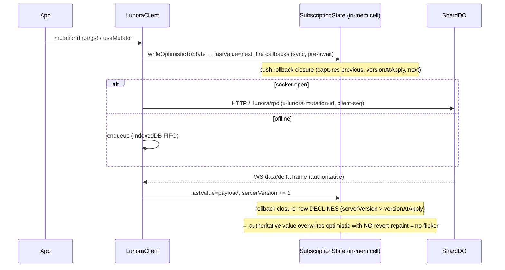
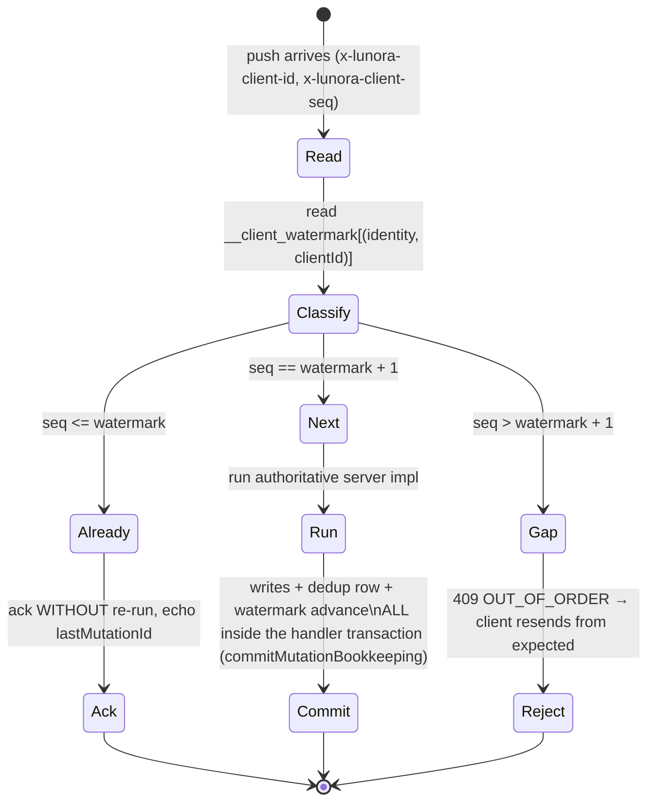
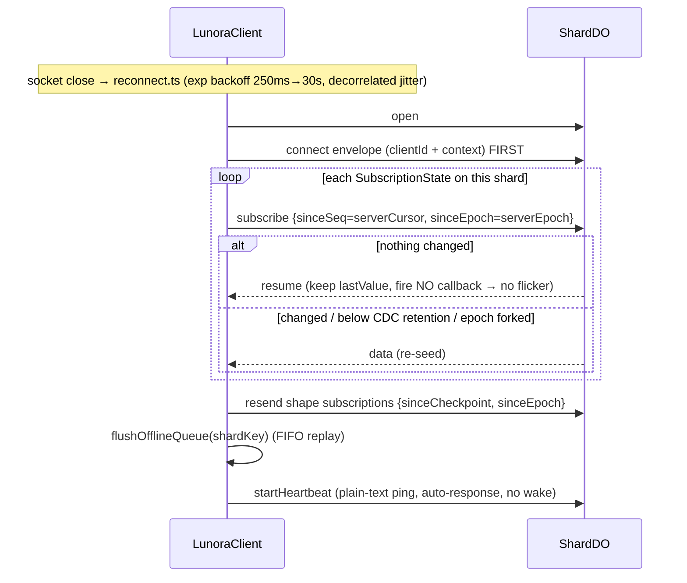

# lunora — Sync Engine: A Complete Visual Understanding

> Reverse-engineered from `research/lunora` (anolilab/lunora, `lunorash@1.0.0-alpha.43`, 2026‑06‑30).
> Every claim is traced to real code as `path:line` against `research/lunora/`.
> Source notes: [`_notes/lunora-A-server-do.md`](./_notes/lunora-A-server-do.md) · [`_notes/lunora-B-client.md`](./_notes/lunora-B-client.md) · [`_notes/lunora-C-wire-glue.md`](./_notes/lunora-C-wire-glue.md)

---

## 0. Thesis in one paragraph

lunora is a **Zero-class sync engine that runs on infrastructure you own** (Cloudflare Durable Objects + D1), not a hosted SaaS. The authoritative database is **per‑shard SQLite inside a Durable Object** (`ShardDO`). It replicates **declarative partial views ("shapes")** to clients, applies writes through **custom mutators** (optimistic on the client, server‑authoritative in the DO), and propagates changes as a **poke diff protocol** — row‑ops (`insert/update/delete`) computed as a *membership diff over only the changed rows*, never by re‑running the query. The client is an **in‑memory live cache + durable IndexedDB outbox**, surfaced to apps as **TanStack DB collections**. The two cleverest load‑bearing ideas: (1) **the DO is single‑threaded**, so writes serialize and there is *no OCC retry loop* and *per‑column convergence is just a JS object spread* — no CRDT; (2) **one `WHERE` compiler serves queries, RLS, and shapes**, so a shape's predicate *is* a read‑permission with zero semantic drift.

---

## 1. Architecture at a glance



**Package roles** (the sync‑relevant subset of ~40 packages):

| Package | Role in sync |
|---|---|
| `@lunora/server` (`packages/server`) | Authoring surface: `defineShape`, `defineMutator`, `rls/` policies, schema. Runs in the user's worker bundle; **codegen discovers it by brand markers**. |
| `@lunora/do` (`packages/do`) | The DO runtime: `ShardDO` (7212 ln god‑class), `ctx.db`, CDC, watermark, poke engine, `ShardRegistryDO`. |
| `@lunora/sql-store` (`packages/sql-store`) | `value-codec` + `SqlDialect` seam (SQLite/PG/MySQL) — row⇄storage encoding. |
| `@lunora/client` (`packages/client`) | `LunoraClient`: in‑memory cache, optimistic overlay, outbox, WS, reconnect. **TanStack‑free by design.** |
| `@lunora/db` (`packages/db`) | TanStack DB binding: `lunoraCollectionOptions`, `bindMutators`, `defineCollections`. |
| `@lunora/react` (`packages/react`) | Hooks: `useMutator`, `useSubscription`, `useLiveQuery` passthrough, `LunoraProvider`. |

---

## 2. The five primitives from the announcement, grounded in code

The launch thread claims five things. Here is each, mapped to the actual implementation.

### 2.1 Shapes — declarative partial replication *that doubles as a read‑permission*

A shape is **table + predicate + optional projection** (`server/src/shapes.ts:35`):

```ts
interface ShapeDefinition<Args, Context = QueryContext> {
  readonly table: string;
  readonly args?: Args;                       // validated on the DO before where() runs
  readonly columns?: ReadonlyArray<string>;   // projection; _id/_creationTime always kept
  readonly where: (context: Context, args) => WhereInput;
}
```

The critical security property: **`where` runs under the socket's *verified* identity, never the client's claim.** A shape runs *no procedure*, so `.use(rls(...))` middleware never fires — instead the codegen `ShardDO.resolveShape(name,args,identity)` (`shard-do.ts:3787`) AND‑composes the shape `where` with the table's RLS read‑base‑where via `composeShapeReadWhere` (`rls/shape-read-base.ts:254`), **reusing the same `computeReadBaseWhere`/`indexRolePermissions` primitives as request‑time RLS** (`rls/middleware.ts`). Result: a shape filter has *zero semantic drift* from an equivalent guarded query. Fail‑closed: under `.rls("required")`, a protected table with no read policy yields `FALSE_PREDICATE = { OR: [] }` → replicate nothing (`rls/shape-read-base.ts:72,187`).

> **The deep idea — one `WHERE` compiler, three callers.** Shapes, RLS, and queries all compile the structural `WhereInput` tree through *the same* `compileWhereSql` (`where-types.ts:3`, `ctx-db-shapes.ts:18`). There is "zero second predicate implementation," so a shape can never diverge from the query/permission semantics it claims to mirror. **This is lunora's answer to the hardest problem in partial replication: making the synced subset and the auth boundary the same object.**

### 2.2 Custom mutators — optimistic client + authoritative server, *no OCC loop*

`defineMutator` pairs a `client` optimistic impl with a `server` authoritative impl (`server/src/mutators.ts`). The `server` body is wrapped in the shard's atomic transaction span (`kind:"mutation"`). The "no OCC‑retry loop" claim is **real and load‑bearing**:

```
runInTransaction (shard-do.ts:2622)
  → state.blockConcurrencyWhile(run)          // DO is single-threaded; dispatch serializes
  → state.storage.transaction(handler)        // workerd's native atomic tx (raw BEGIN/COMMIT forbidden)
```

Because `blockConcurrencyWhile` serializes *all* dispatch, "a `ConflictError` here is a deterministic self‑conflict, not a race to retry" (`mutators.ts:14`). OCC survives **only** as a CAS guard against the DO's *own intra‑mutation `await`* (before‑update triggers, cascades): `patch`'s UPDATE carries `AND __doc__ = <read-time snapshot>` (`ctx-db.ts:2933`); zero rows ⇒ `ConflictError(...,"occ")`.

### 2.3 The poke diff protocol — membership diff, *not* a re‑run

This is the headline. On a write, the DO does **not** re‑run shape queries against the whole table. `buildShapeDiff` (`shard-do.ts:6352`):

1. **Drain the CDC op‑slice** for changed ids since this shape's memo cursor (`readShapeOpRange`), collapsing multiple ops on the same id to the newest. One drain is shared across all shapes on a table (`opRangeCache`).
2. **Probe membership of only the changed ids**: `selectShapeMemberIds(sql, table, effectiveWhere, ids)` → `id IN (...) AND <compiled effectiveWhere>` (`ctx-db-shapes.ts:107`). Cost is bounded by *writes*, not table size.
3. **Derive row‑ops** from `CDC‑op × membership`:
   - still a member + post‑image → `{op, value: projectColumns(doc, columns)}` (upsert)
   - `insert` that never matched the predicate → **emit nothing** (was never replicated)
   - left the set, or a `delete` → `{op:"delete"}` (conservative; no‑op on a client that never held it)

Wire framing is the **Zero‑style poke trio**, applied **atomically at `pokeEnd`** (`shape-global-diff.ts:116`):

```ts
ServerPokeStartMessage { type:"pokeStart"; pokeId; baseCheckpoint?; epoch? }
ServerPokePartMessage  { type:"pokePart";  pokeId; shapeId; rowsPatch: RowOp[]; lastMutationId? }
ServerPokeEndMessage   { type:"pokeEnd";   pokeId; checkpoint?; epoch? }
RowOp { table; key; op:"insert"|"update"|"delete"; value? }
```

`.global()` (D1‑backed) tables have no per‑DO op‑log, so they fall back to an **alarm poll** that re‑reads full membership and diffs against a **durable** `__global_shape_snapshot` baseline (persisted, not a `WeakMap`, specifically so a hibernation eviction can't drop a `delete` and leave a phantom row — `ctx-db-global-shape-snapshot.ts:8`).



### 2.4 Offline outbox + live WebSocket sync

The outbox (`client/offline-queue.ts`) is a **bounded FIFO (default 1000)** persisted to IndexedDB (autoincrement key = FIFO order). It is **at‑least‑once durable, made effectively exactly‑once** by replaying under the original idempotency key `x-lunora-mutation-id`, which the server dedups via the watermark. Replay is **sequential** (`await` in a `for` loop, *not* parallel) to preserve order for dependent mutations. Three subtle guards:

- **Per‑item identity re‑read at flush** (FNV‑1a fingerprint of the bearer token) closes a token‑rotation‑mid‑flush hole where user A's queued write could replay as user B (`lunora-client.ts:3756`). Mismatch → `OFFLINE_IDENTITY_CHANGED`.
- **Poison‑message policy**: only a *coded* server error (a verdict was reached) drops a write; an uncoded transport error re‑queues the FIFO tail and stops for the next reconnect (`:3807`).
- **Overflow** rejects the oldest with `OFFLINE_QUEUE_OVERFLOW`.

The live channel is **one hibernatable WebSocket per shardKey**. Keepalive is a **plain‑text `"lunora-ping"`** answered by the DO's `setWebSocketAutoResponse` **without waking the DO** (zero billable wakeups) — `lunora-client.ts:93`.

### 2.5 TanStack DB collections, on‑device

`@lunora/db`'s `lunoraCollectionOptions({ shape })` (XOR `{ list }`) builds a TanStack DB collection config: a `makeDiffEmit`, an eager B‑tree autoindex, a `CheckpointRegistry` of monotonic gates, and `subscribeShape`. `bindMutators` opens an optimistic `createTransaction`, applies predicted rows, then FIFO‑pushes via `callMutator` at `clientSeq = watermark+1`. `useMutator` is a thin React wrapper; **reads stay on `useLiveQuery`** — no new query hook (`react/use-mutator.ts:26`).

---

## 3. The optimistic write & flicker‑free rebase (client)

There is **no transaction object** in `@lunora/client`. The "rebase" is a **monotonic `serverVersion` counter + a LIFO array of rollback closures**. This is the cleverest client trick:



The flicker‑free guard (`lunora-client.ts:313`): the rollback restores `previous` **only if** `serverVersion <= versionAtApply` **and** `lastValue === next`. Once the server frame bumps `serverVersion`, rollback is a no‑op — the authoritative value simply *is* the new value. For custom mutators the overlay‑drop signal is the **watermark** (`settled`/`pokeEnd` carry `lastMutationId` → `onCheckpoint` collapses the TanStack overlay even when the result is byte‑identical and no data frame is sent).

---

## 4. The watermark protocol (idempotent + ordered pushes)



Table: `__client_watermark(identity, client_id, last_mutation_id, PRIMARY KEY(identity, client_id))` (`ctx-db-client-watermark.ts:53`). **Scoped by authenticated identity** so a spoofed `clientId` under another user can't suppress the real owner's sequence. The protocol **self‑heals** a crash between handler‑commit and a non‑atomic advance: the unacked replay re‑classifies `"next"`, re‑runs idempotently (the dedup row dedups the real write), re‑advances — only ever replaying, never skipping or double‑applying.

---

## 5. Reconnect & catch‑up (hibernation‑aware)



**Gap/fork detection at `pokeEnd`** (`lunora-client.ts:3417`): if the epoch forked (`buffer.epoch !== serverEpoch`) or the base diverged (`serverCursor !== buffer.baseCheckpoint`), the client **clears the view, nulls cursor/epoch, skips the ops, and re‑subscribes** for a clean re‑seed — rather than silently splicing onto forked data.

---

## 6. Wire‑protocol catalog (the contract on the socket)

Two discriminated unions keyed on `type` in `client/src/types.ts`.

**Client → Server** (`ClientMessage`, `:347`): `connect` · `subscribe{query:{functionPath?,table?,args?,sinceSeq?,sinceEpoch?}}` · `unsubscribe` · `shape_subscribe{shape:{name,args?},sinceCheckpoint?,sinceEpoch?}` · `shape_unsubscribe` · `stream` · `ack` · `whisper*` · plain‑text `"lunora-ping"`.

**Server → Client** (`ServerMessage`, `:473`): `data`/`delta{data?,delta?,cursor?,epoch?,lastMutationId?}` · `resume` · `settled` (write touched read‑tables but byte‑identical result) · `ack`/`complete`/`error` · `chunk` (stream) · `pokeStart`/`pokePart`/`pokeEnd` · `whisper`.

**Mutator push is HTTP, not WS**: `POST /_lunora/rpc` body `{args,functionPath,shardKey}`; headers `authorization`, `x-lunora-mutation-id` (idempotency), `x-lunora-client-id` + `x-lunora-client-seq` (watermark), `x-d1-bookmark` (D1 Sessions read‑your‑writes). Response `{error{code,message}} | {result, lastMutationId?}`.

**Storage codec** (`sql-store/value-codec.ts`): `sqliteEncode` maps `boolean→1/0`, `bigint→decimal string`, `Uint8Array/ArrayBuffer→BLOB` (checked before the JSON fallback), else `JSON.stringify`; `sqliteDecode(raw, kind)` reverses by *effective validator kind* (`v.optional` unwrapped). `_id`⇄physical `id`, `_creationTime` preserved. The `SqlDialect` seam lets one core drive SQLite/PG/MySQL.

---

## 7. Convergence model: per‑column LWW, **no CRDT**

```ts
// ctx-db.ts:2907 — the entire convergence mechanism
const merged = { ...existing, ...patch, _id: id };   // only keys in `patch` overwrite
```

Two offline edits to *different* fields of the same row each `patch` only their own field. When both replay through the **serialized** DO, each merges over the other's already‑committed doc → **both survive**. This is **per‑column last‑writer‑wins, achieved by a JS object spread**, not a CRDT. Caveats: two edits to the *same* field still LWW‑collapse (per‑column, not per‑character); `patch(id,{field:undefined})` is *rejected* (`assertNoExplicitUndefined`) — pass `null` to clear. The whole scheme works **only because the DO is single‑threaded**; this is the architectural bet that buys away the CRDT.

---

## 8. Sharding

A **shard = one Durable Object = one SQLite database**, addressed by a shard key (`.shardBy(key)` partitions by user/tenant/room; default is a single `__root__` DO). `ShardRegistryDO` (`shard-registry-do.ts`) is the persistent source of truth for *which shard keys are live per table* (`Map<table, Set<shardKey>>`), so the coordinator can fan a cross‑shard read to every live shard for **dynamic** cardinality (e.g. one shard per user‑created channel). A key registers on first‑seen write off the user path (`ctx.waitUntil`).

---

## 9. Reactive cache & dependency tracking

`DependencyTracker` stamps a dep `table:id` for every row a query reads, plus a `table:*scan` marker for any non‑index read (those must invalidate on *every* write to the table, since a `patch` can flip a row in/out of a scan predicate). It is **ctx‑threaded, not AsyncLocalStorage** — because shard DOs run the slimmer `sqlite_compat` profile, not `nodejs_compat`. `ReactiveCache` memoizes results keyed by `(fnPath, argsHash, identity)` — **identity is mandatory** so the shared single‑DO doesn't serve user A's RLS‑filtered result to user B. Invalidation fires from the **same write hooks** that drive CDC + broadcast, so the reactive layer and the sync layer never drift.

---

## 10. The clever decisions (steal list)

1. **One `WHERE` compiler for query + RLS + shape** → the synced subset *is* the auth boundary; impossible to drift.
2. **Membership diff over changed ids** (`selectShapeMemberIds`) → poke cost is O(writes), not O(table).
3. **Single‑threaded DO ⇒ no OCC loop + per‑column convergence is a spread** → CRDT‑free convergence.
4. **`serverVersion` counter as rebase arbiter** → flicker‑free reconcile without OT/CRDT on the client.
5. **Same idempotency key on direct send *and* replay** → at‑least‑once durability reads as exactly‑once.
6. **Per‑item identity re‑read at flush** → closes the token‑rotation‑mid‑flush cross‑user replay hole.
7. **Atomic poke‑at‑`pokeEnd` + epoch/baseCheckpoint gap detection** → no torn views; forks force a clean re‑seed.
8. **Plain‑text ping answered by DO auto‑response** → hibernation keepalive with zero wakeups.
9. **Durable global‑shape snapshot** (not `WeakMap`) → fixes a real phantom‑row bug across hibernation eviction.
10. **CDC epoch paired with seq cursor** → a recycled‑DO timeline fork forces re‑snapshot instead of silently resuming onto forked data.

---

## 11. Honest limitations & open edges

- **Client live store is in‑memory** (not SQLite/IndexedDB‑reactive). IndexedDB backs only the outbox + an optional read cache. Large datasets / cross‑session reactive persistence are not the design point (contrast: Zero/LiveStore put a real SQLite on the client).
- **Convergence is per‑column LWW**, not per‑field‑intent or per‑character — concurrent edits to the *same* column collapse; no rich‑text/CRDT merge.
- **`.global()` (D1) shapes use alarm polling + full re‑read**, not incremental diff — a scaling asymmetry vs shard‑local shapes.
- **`delta` insert ordering** honors only `_creationTime` ascending; a custom server sort can mis‑order an optimistically merged delta until the next snapshot (`delta-merge.ts:54`).
- **`commitMutationBookkeeping` call site** lives in codegen output (`_generated/*`), not read here — the watermark‑inside‑transaction wiring is documented but the concrete generated call wasn't opened.
- **Single‑threaded DO is also the scaling ceiling**: per‑shard throughput is one write at a time; hot shards serialize. Sharding granularity is the tuning knob.

---

## 12. Symbol index (where to look)

| Concept | File:line |
|---|---|
| `defineShape` | `server/src/shapes.ts:81` |
| Shape where‑as‑permission | `server/src/rls/shape-read-base.ts:254` |
| `defineMutator` | `server/src/mutators.ts` |
| DO transaction / serialization | `do/src/shard-do.ts:2622` (`runInTransaction`) |
| `ctx.db.patch` per‑column merge | `do/src/ctx-db.ts:2907` |
| CDC changelog | `do/src/ctx-db-cdc.ts:25` |
| Watermark table + classify | `do/src/ctx-db-client-watermark.ts:53`, `shard-do.ts:3343` |
| `buildShapeDiff` (poke) | `do/src/shard-do.ts:6352` |
| `selectShapeMemberIds` | `do/src/ctx-db-shapes.ts:107` |
| Poke frames | `do/src/shape-global-diff.ts:116` |
| ShardRegistry | `do/src/shard-registry-do.ts` |
| Reactive cache / dep tracker | `do/src/reactive-cache.ts`, `dependency-tracker.ts` |
| Optimistic overlay + rebase | `client/src/lunora-client.ts:296-340` |
| Offline outbox | `client/src/offline-queue.ts` |
| Wire message unions | `client/src/types.ts:347,473` |
| Value codec | `sql-store/src/value-codec.ts` |
| TanStack collection options | `db/src/collection-options.ts` |
| `useMutator` | `react/src/use-mutator.ts` |
