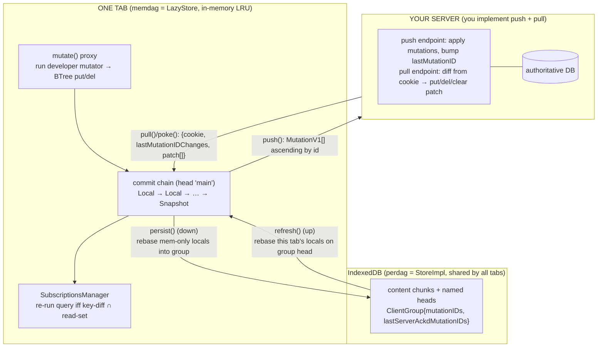
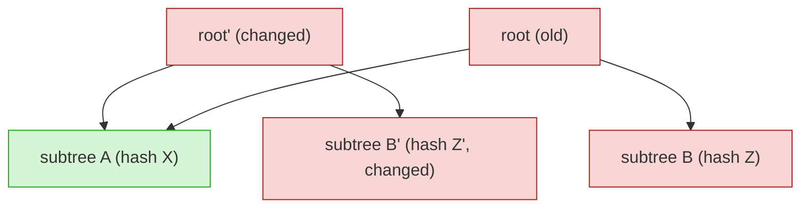

# Replicache — Sync Engine: A Complete Visual Understanding

> Reverse-engineered from `research/zero-mono/packages/replicache/src/` (the real source; the standalone `replicache` repo is now just an issues pointer). Replicache is the **foundation Zero is built on**. Every claim is `path:line`.
> Source note: [`_notes/replicache.md`](./_notes/replicache.md). Design-rationale: Aaron Boodman talk in [`_notes/youtube/SYNTHESIS.md`](./_notes/youtube/SYNTHESIS.md).

---

## 0. Thesis in one paragraph

Replicache is a **versioned, git-like commit graph over a prolly B+tree key-value map**, persisted in IndexedDB, kept in sync with a **server you write yourself** via two endpoints (`push`, `pull`). A local mutation is a real **optimistic commit** on the chain, so the UI updates instantly. When the server's authoritative snapshot arrives, pending local commits are **rebased** onto it — and rebase does *not* replay a recorded diff, it **re-runs the mutator function** (`name` + `args`) on the new basis. Convergence is therefore **server authority + deterministic mutator replay** — *no CRDT, no OT, no query engine*. Replicache deliberately stops there; the query/IVM layer is **Zero**, which plugs into the exact same engine.

The single most important idea to carry into Nizhal: **the mutator function *is* the conflict-resolution policy.** There is no separate merge algorithm — correctness comes from running the same deterministic function again on newer state.

---

## 1. Architecture: the dual DAG + the commit chain



**memdag vs perdag** (`replicache-impl.ts:482`): `perdag` = persistent IndexedDB DAG shared across tabs (slow); `memdag` = a `LazyStore` LRU cache over it where *this tab's* live reads, optimistic mutations, and rebases happen. Uncommitted local work lives mem-only until `persist()` flushes it down.

---

## 2. The commit graph (the heart)

A commit wraps a DAG chunk whose data is `{meta, valueHash, indexes}` — `valueHash` is the B+tree root (the client view). Two live commit types:

```ts
// LOCAL = optimistic mutation (commit.ts:257)
LocalMetaDD31 {
  type: LocalDD31; basisHash;            // parent (chain link)
  mutationID: number;                    // monotonic per client
  mutatorName: string; mutatorArgsJSON;  // ← replayable INTENT, not a diff
  originalHash: Hash|null;               // pre-rebase identity
  clientID; timestamp; baseSnapshotHash;
}
// SNAPSHOT = authoritative server state (commit.ts:298)
SnapshotMetaDD31 {
  type: SnapshotDD31; basisHash;
  lastMutationIDs: Record<ClientID, number>;  // server-acked id per client
  cookieJSON: FrozenCookie;                    // opaque server cursor
}
```

Walking `basisHash` back from head `'main'`: `Local → Local → … → Snapshot`. The locals above the base snapshot **are** the pending (un-acked) mutations.

---

## 3. Optimistic write → push → pull → rebase

```mermaid
sequenceDiagram
  participant App
  participant RC as ReplicacheImpl (memdag)
  participant Srv as your server
  App->>RC: mutate.createTodo(args)
  RC->>RC: newWriteLocal → run mutator → BTree put/del
  RC->>RC: commitWithDiffs('main') — real Local commit, mutationID = prev+1
  RC-->>App: fire(diffs) — UI updates INSTANTLY (optimistic)
  RC->>Srv: push MutationV1[]{id,name,args,clientID} ascending
  Note over Srv: apply each mutation in a tx; bump lastMutationID[clientID]
  Srv-->>RC: poke / pull: {cookie', lastMutationIDChanges, patch[]}
  Note over RC: PHASE A — build new Snapshot on side head 'sync'\nfrom baseSnapshot.map + patch (put/del/clear)
  Note over RC: PHASE B — keep locals with mutationID > newSnapshot.lmid\n(acked ones DROP), re-run their mutators on 'sync' (rebase)
  RC->>RC: atomically main := sync; fire(diff main↔sync)
  RC-->>App: UI converges to authoritative state
```

**Rebase** (`db/rebase.ts:25`) is the crux — it re-executes the mutator:

```ts
const dbWrite = await newWriteLocal(basisHash, name, args, mutation.chunk.hash, ...);
const tx = new WriteTransactionImpl(clientID, mutationID, 'rebase', ...);
await mutatorImpl(tx, args);   // ← RE-RUN the function on newer state
```

Invariants baked in: the `mutationID` must line up with the new basis (mutations replay in creation order); a mutator **name that no longer exists** stubs to a no-op rather than crashing (so you must *never delete a mutator name*).

```
main:  S0 ─ L1 ─ L2 ─ L3        pull: build S1 on 'sync' from S0+patch; lmid says L1 acked
sync:  S0 ─ S1                  rebase L2,L3 onto S1 (re-run mutators); drop L1
sync:  S0 ─ S1 ─ L2' ─ L3'      fast-forward: main := sync
```

`poke()` is the push-driven variant: the server pushes `{baseCookie, PullResponse}` and the client runs the *identical* `handlePullResponseV1 → maybeEndPull` reconciliation with no client-initiated HTTP.

---

## 4. The wire protocol (you implement both endpoints)

```ts
// PUSH (client → your server)
PushRequestV1 { pushVersion:1; schemaVersion; profileID; clientGroupID; mutations: MutationV1[] }
MutationV1    { id; name; args; timestamp; clientID }     // id == LocalMetaDD31.mutationID

// PULL (client → your server)
PullRequestV1  { pullVersion:1; schemaVersion; profileID; cookie; clientGroupID }
PullResponseOK { cookie; lastMutationIDChanges: Record<ClientID,number>; patch: PatchOperation[] }
PatchOperation = {op:'put';key;value} | {op:'del';key} | {op:'clear'}
```

- **Cookie** = opaque server cursor (`null|string|number|{order}`). Client never interprets it — only **orders** it via `compareCookies`. Send current base-snapshot cookie → server returns the delta to a newer one.
- **Idempotency is the server's job**, enabled by monotonic `(clientID, mutationID)`: the server keeps a `lastMutationID` watermark per client and skips any `id <=` it. That watermark is also what **drops** an acked local during pull Phase B.
- The server speaks **only `put/del/clear` over an opaque key→JSON map** — Replicache has *no* notion of tables/schemas/relations; those are app conventions over flat keys.

---

## 5. Why diffing is cheap (the prolly B+tree)

Each commit's value map is a B+tree whose nodes are DAG chunks: leaves hold `Entry<JSON>`, internal nodes hold `Entry<Hash>` (key → child chunk hash). `BTreeWrite.flush()` rewrites **only dirty nodes** bottom-up, so unchanged sibling subtrees keep their chunk hash.



`diff(old,new)` walks both trees in lockstep; when two internal entries have **equal child hashes**, `computeSplices` emits nothing and **the entire subtree is skipped unread**. So diff cost is O(changed nodes), not O(tree size). That diff is the load-bearing primitive for subscriptions (and for the pull diff). **Nuance** (`hash.ts:27`): hashes are now random UUID+counter, *not* content digests — structural sharing comes from the write path not re-writing unchanged nodes, not from content addressing.

---

## 6. Multi-tab: client groups, persist/refresh

A **Client** = one tab. A **ClientGroup** is shared by all tabs with the *same mutator names + index defs*; it stores `mutationIDs` (highest local per client) and `lastServerAckdMutationIDs` (highest acked) — their difference is the "is there unpushed work?" check, and it lets one tab **recover a dead tab's pending mutations**. Tabs reconcile via `persist()` (memdag → perdag, down) and `refresh()` (perdag → memdag, up) — **both built on the same rebase primitive as pull.** Liveness via 60s `heartbeat`; dead clients/groups are GC'd.

---

## 7. What Replicache deliberately does NOT do (the Zero boundary)

1. **No queries / no IVM** — reactivity is "re-run the subscription body if the key-diff hits its read-set." The query engine is **Zero** (`zql`, `zero-cache`), which plugs in via `ReplicacheImpl`'s `#zero?.advance(...)` hooks.
2. **No built-in server** — you implement `push`/`pull`. The client only knows the `Pusher`/`Puller` *functions* and JSON shapes.
3. **No tables/schema on the wire** — only `put/del/clear` over an opaque key→JSON map.
4. **No conflict resolution beyond rebase** — no OT, no CRDT. The mutator *is* the policy.
5. **You must never delete/rename a mutator** — pending mutations replay by `(name,args)`; a missing name silently no-ops.

---

## 8. The steal list (for Nizhal)

| Idea | Why it matters |
|---|---|
| **Mutator = conflict policy** (deterministic replay) | CRDT-free convergence; the developer owns the write path — *exactly Nizhal's stated bet* (`one mutator = one transaction`). |
| **Monotonic `(clientID, mutationID)` + server `lastMutationID` watermark** | Idempotent, ordered push. Nizhal has this (`clientMutationId` + HLC); compare the *recovery* story. |
| **Git-like commit chain of optimistic locals** | Clean rebase semantics, multi-tab recovery, "which mutations are pending" is structural, not bookkept. |
| **Prolly-tree hash-equality diff** | O(changed) reactive diffing on the client. Nizhal uses TanStack DB; note this is the property TanStack's collections must also provide. |
| **Client groups (shared perdag + per-tab memdag)** | Cross-tab mutation recovery without re-reading the graph. Does Nizhal handle multi-tab? (open gap to check) |
| **Opaque cookie cursor** | The server controls pagination/snapshot ordering without leaking its internals. Compare to Nizhal's `/sync/pull` cursor. |

---

## 9. Symbol index

| Concept | File:line |
|---|---|
| Commit types | `db/commit.ts:257,298` |
| Optimistic write | `replicache-impl.ts:1511` (`#mutate`) |
| Rebase (re-run mutator) | `db/rebase.ts:25` |
| Push protocol | `sync/push.ts:36,109` |
| Pull two-phase | `sync/pull.ts:203` (`handlePullResponseV1`), `:304` (`maybeEndPull`) |
| Patch ops | `patch-operation.ts:37`, `sync/patch.ts:94` |
| Cookie ordering | `cookies.ts:9,38` |
| BTree diff | `btree/read.ts:158`, `btree/splice.ts:33` |
| memdag/perdag | `replicache-impl.ts:482`, `dag/lazy-store.ts:17` |
| Client groups | `persist/client-groups.ts:12`, `persist/clients.ts:46` |
| persist/refresh | `persist/persist.ts:45`, `persist/refresh.ts:61` |
