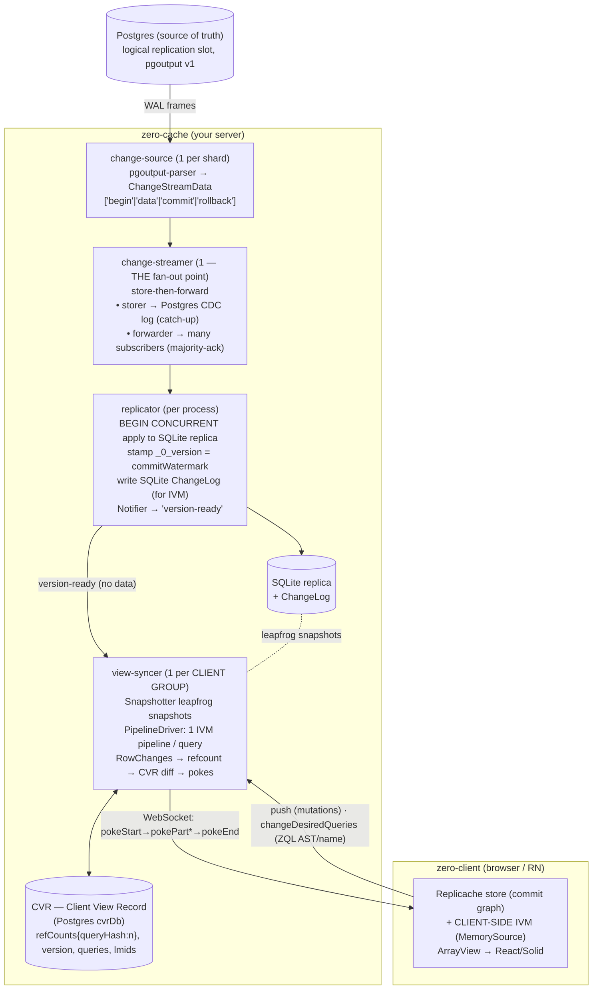
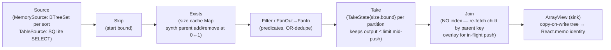

# Zero (rocicorp) — Sync Engine: A Complete Visual Understanding

> Reverse-engineered from `research/zero-mono/packages/{zql,zqlite,zero-cache,zero-client,zero-protocol}`. Zero is **Replicache + a query engine (ZQL/IVM) + a sync server (zero-cache)**. Every claim is `path:line` relative to `packages/`.
> Source notes: [`_notes/zero-zql-cache.md`](./_notes/zero-zql-cache.md) · [`_notes/zero-client-protocol.md`](./_notes/zero-client-protocol.md). Read [`replicache-sync-engine.md`](./replicache-sync-engine.md) first — Zero reuses Replicache's commit/rebase/poke substrate.

---

## 0. Thesis in one paragraph

Zero makes **the database query the unit of sync**. The client writes ZQL queries; the server syncs *exactly the rows those queries return, and only the ones the user is permitted to see*, and keeps them **live** via **incremental view maintenance (IVM)** — a dataflow graph of stateful operators that turns a stream of row changes into a stream of result changes without re-running the query. The server (`zero-cache`) tails Postgres logical replication into a **SQLite replica**, runs **one IVM pipeline per client query**, and emits **pokes** (the same poke trio Replicache uses). The same IVM also runs **on the client** over a local store, so optimistic writes update query results instantly. Two ideas dominate: (1) **partial replication = the union of clients' query results**, with **permissions enforced by rewriting the query AST** (`where' = AND(originalWhere, OR(allow-rules))`) — the synced set and the auth boundary are the same object; (2) the **CVR (Client View Record)** is a server-side, **refcounted** memory of what each client group holds, so a row referenced by N queries is synced once and deleted only when all N drop it.

> The line to carry into Nizhal: **Zero is what you get when you push partial replication all the way to "live queries with IVM."** lunora's "shapes + membership diff" and Nizhal's "buckets + cursor pull" are *cheaper points on the same axis*. Zero pays for full IVM; the others pay less and get less liveness. Knowing where Nizhal sits on that axis is the core of the review.

---

## 1. The full data path (Postgres → client)



**The two change-logs you must not conflate:** the change-streamer's **Postgres CDC log** (durable history for subscriber catch-up) and the replica's **SQLite ChangeLog** (what the view-syncer diffs to drive IVM). **The slot only advances after a change is durably stored** (ack chain: subscriber/storer commit → source Acker → PG standby status).

---

## 2. The IVM core: hierarchical Change/Node

Zero's IVM is the novel heart. A `Change` is a **tuple** (hot code, not an object) tagged ADD/REMOVE/EDIT/CHILD (`zql/ivm/change.ts`):

```ts
AddChange    = [ADD,    node: Node, null]
RemoveChange = [REMOVE, node: Node, null]
ChildChange  = [CHILD,  node: Node, {relationshipName, change}]   // recursive — a descendant changed
EditChange   = [EDIT,   node: Node, oldNode: Node]                // row mutated in place

Node = { row: Row; relationships: Record<string, () => Stream<Node | 'yield'>> }
```

A `Node` is a row **plus lazily-generated child streams** → IVM results are **hierarchical** (a parent carrying child nodes under named relationships), *not* a flat join table. Sources speak a flatter `SourceChange` (row-only); operators turn rows into nodes-with-relationships. Every operator is **both an `Input` (`fetch()`, pull, sorted) and an `Output` (`push(change)`, incremental)**, and a `'yield'` sentinel threads through every stream for cooperative **time-slicing** (so a giant fetch can't block the event loop).

---

## 3. IVM operator catalog (how each maintains state)



| Operator | State it keeps | Trick |
|---|---|---|
| **Source** | `MemorySource`: one `BTreeSet<Row>` per distinct sort, shared across connections. `TableSource`: a real SQLite table. | An **Overlay** `{epoch, change}` makes an in-flight pushed change visible to fetches during the *same* push without committing it — so self-joins see consistent state. Rows written *after* being vended. |
| **Join** | **None of its own** — re-derives children by fetching the child input with a constraint from the parent key. | Keeps only the in-progress child change + an overlay. `FlippedJoin` batches child→parent fetches into one `IN (… 256 …)` for `where exists`. |
| **Exists** | `Map<joinKey, boolean>` size cache (per `beginFilter`/`endFilter` loop). | On a child add/remove it recomputes relationship size and **synthesizes a parent add/remove at the 0↔1 boundary** (inverted for `NOT EXISTS`). `Cap` terminates the count early. |
| **Take** (limit) | `{size, bound}` per partition in `Storage`. | Remembers the last accepted row (**bound**) so a push is accepted/rejected cheaply; maintains `output ≤ limit` even mid-push; refills on remove. |
| **FanOut→FanIn** | FanIn accumulates per-branch pushes. | For `where` with OR-of-subqueries: FanOut forks a row to every branch; FanIn **dedupes** so a row matching multiple branches emits once. |
| **ArrayView** (sink) | Materialized JS tree (`Entry`/`EntryList`). | **Copy-on-write**: unchanged subtrees keep reference identity → `React.memo`/Solid skip re-render. |

`buildPipeline` (`builder.ts:126`) maps a ZQL AST → `Source → Skip → Exists → Filter/FanOut → Take → Join…` ending in `ArrayView` (client) or a row-streamer (server). Static auth params are bound into the AST before building.

---

## 4. Server flow: query → pipeline → poke

```mermaid
sequenceDiagram
  participant REP as replicator
  participant VS as view-syncer (per client group)
  participant PD as PipelineDriver (IVM)
  participant CVR as CVR (refcounted)
  participant CH as ClientHandler
  participant C as zero-client
  REP->>VS: version-ready {watermark} (no data)
  VS->>PD: advance() — Snapshotter SnapshotDiff(lastVersion→current)
  loop each changed row
    PD->>PD: SourceChange into TableSource → fans through all query pipelines
    PD->>VS: streamer.accumulate(queryID, RowChange[])
    Note over PD: DROP any system:'permissions' subtree (never sent to client)
  end
  VS->>CVR: RowUpdate.refCounts[queryID] += / −  per ADD/REMOVE
  CVR-->>VS: row refcount→0 ⇒ DEL patch; else PUT patch
  VS->>CH: addPatch(...)
  CH->>C: pokeStart{pokeID,baseCookie} → pokePart{rowsPatch, gotQueriesPatch, lastMutationIDChanges} → pokeEnd{cookie}
  Note over C: apply patches to local Replicache store → feeds CLIENT-side IVM → ArrayView updates
```

The poke is **the same multi-part poke as Replicache**, but the `rowsPatch` is computed by **IVM diff + CVR refcount**, not by a developer's pull endpoint. The client merges pokes into Replicache keys (`e/` rows, `d/`/`g/` desired/got queries, `m/` mutation results) via `mergePokes`, faking a Replicache pull response — so Replicache's rebase machinery is reused unchanged.

---

## 5. The CVR — what the server remembers per client group

```ts
type CVR = {
  id: string;                               // = clientGroupID
  version: CVRVersion;                      // monotonic {stateVersion, minorVersion}
  replicaVersion: string | null;            // replica lineage it was built against
  clients: Record<string, ClientRecord>;    // desired queries + lmid per client
  queries: Record<string, QueryRecord>;     // GOT queries: ast, transformationHash, ttl
};
// each CVR row record: refCounts: {[queryHash]: number}  — synced once, deleted at 0
```

The CVR (in a Postgres `cvrDb`) is the server's memory of every client group's synced state. **Rows are refcounted, not duplicated** — a row referenced by three queries is synced once and deleted only when all three drop it. The client's `baseCookie` (= serialized `CVRVersion`) gates pokes (`toVersion > baseVersion`). New/behind clients are caught up from stored CVR patches. A per-query **XOR row-set signature** detects non-deterministic re-hydration drift and forces a re-sync.

---

## 6. Partial replication + permissions = one object

**Partial replication** = the union of all clients' active query results is the *only* data ever sent; the CVR's refcounted rows *are* the per-group partial replica. (This is why **`NOT EXISTS` is server-only** — a client can't distinguish "row doesn't exist" from "row not synced".)

**Permissions are enforced by rewriting the AST** (`auth/read-authorizer.ts`), not a runtime gate:

```
transformQuery(table, ast):
  rules = permissionRules.tables[table].row.select
  if !rules: inject empty OR  → DEFAULT-DENY (fail closed)
  where' = AND(originalWhere, OR(rule1, rule2, …))
  recurse into related AND where-position correlated subqueries   // close the existence-oracle hole
  bind JWT claims as literals
  transformationHash = hashOfAST(transformed)   // changed hash ⇒ re-hydrate
```

Permission rules can read tables the user can't see, so any IVM subtree the permission system adds is tagged `system:'permissions'` and the streamer **never sends those rows to the client**. Queries are re-transformed on every (re)connect so auth is re-validated against current claims.

---

## 7. Client side (the zero-client view)

- **Queries are the sync unit.** ZQL → `AST` → hash. A `QueryManager` keeps a refcounted `Map<hash, Entry>`, dedups, LRU-defers removal, and batches `changeDesiredQueries`. Legacy queries send the AST; **custom queries send only `name + args`** (the server transforms them to ASTs — the analog of "named server queries").
- **Mutations: CRUD vs custom.** CRUD mutators (`_zero_crud`, being removed) vs **custom mutators** (server-authoritative; the *same function* runs optimistically on the client and authoritatively on the server, returning `{client, server}` promises). Push sends one message per mutation; idempotency via `#lastMutationIDSent` + the server's `lmid`.
- **Rebase is Replicache DD31**: pending local commits with `mutationID > snapshot.lmid` are replayed on the new snapshot (re-running custom mutators with `reason==='rebase'`).
- **Wire** (`zero-protocol`): JSON tuples `[type, body]`, valita-validated. Upstream (10): `initConnection, push, changeDesiredQueries, pull, ackMutationResponses, ping, updateAuth, deleteClients, closeConnection, inspect`. Downstream (11): `connected, pokeStart/Part/End, pushResponse, pull, transformError, error, pong, deleteClients, inspect`. Pokes gap-detect via `baseCookie` (`unexpected cookie gap`).

---

## 8. Steal list (for Nizhal)

| Zero idea | Relevance to Nizhal |
|---|---|
| **Permissions by AST rewrite** (`where' = AND(where, OR(rules))`), recursing into `where`-position subqueries, default-deny | Nizhal enforces write-auth by post-write bucket-scope check + no-leak lint on *read*. Zero's **recursion into correlated subqueries to close the existence-oracle** is a concrete hardening idea worth checking against Nizhal's sync-rule predicates. |
| **`system:'permissions'` subtree never streamed** | A clean pattern for "use a row you can't see to make an auth decision without leaking it." |
| **CVR refcounting** (sync a row once across N queries; delete at refcount 0) | Nizhal pulls per-bucket; overlapping buckets could re-send/duplicate. Refcounting is how Zero avoids that — relevant if Nizhal ever supports overlapping bucket membership. |
| **IVM for live queries** | Nizhal delegates reactivity to **TanStack DB** on the client and has **no server-side IVM** (cursor pull + repull hint). This is the single biggest architectural difference — and a deliberate one (no-WAL). The review must decide whether any *primitive* (e.g. server-computed deltas vs full repull) is worth borrowing without adopting IVM. |
| **Custom query = name+args, server transforms to AST** | Mirrors Nizhal's mutator-by-name. Zero applies the same to *reads*. Nizhal's reads are sync-rules, not named queries — a possible primitive gap (parameterized server-defined reads). |
| **Hierarchical Node (relationships as lazy child streams)** | Nizhal's `related` queries in sync-rules are flat bucket-scoped joins; Zero's hierarchical result is what makes nested live queries cheap. |
| **`'yield'` cooperative time-slicing** | For large initial hydration/pull, a yield budget prevents event-loop stalls — relevant to Nizhal's "large initial pull pages until caught up" path. |

---

## 9. Symbol index

| Concept | File:line |
|---|---|
| Change/Node types | `zql/ivm/change.ts`, `zql/ivm/data.ts:10` |
| Operator contract | `zql/ivm/operator.ts:43,107` |
| MemorySource / Overlay | `zql/ivm/memory-source.ts:59,69` |
| TableSource (SQLite) | `zqlite/src/table-source.ts:224,283` |
| Join (no index) | `zql/ivm/join.ts:252` |
| Exists (size cache) | `zql/ivm/exists.ts:109` |
| Take | `zql/ivm/take.ts:29` |
| FanOut/FanIn | `zql/ivm/fan-out.ts`, `fan-in.ts:76` |
| ArrayView (CoW sink) | `zql/ivm/array-view.ts:159` |
| buildPipeline | `zql/builder/builder.ts:126` |
| change-source (pgoutput) | `zero-cache/.../change-source/pg/stream.ts:198` |
| change-streamer fan-out | `zero-cache/.../change-streamer/change-streamer-service.ts:354` |
| replicator apply | `zero-cache/.../change-processor.ts:322` |
| view-syncer loop | `zero-cache/.../view-syncer.ts:466` |
| Snapshotter leapfrog | `zero-cache/.../snapshotter.ts:32` |
| CVR | `zero-cache/.../cvr.ts:58` |
| permission AST rewrite | `zero-cache/.../auth/read-authorizer.ts:24` |
| poke handler | `zero-cache/.../client-handler.ts:188` |
| wire unions | `zero-protocol/src/up.ts:12`, `down.ts:16` |
| mergePokes | `zero-client/.../zero-poke-handler.ts:214` |
